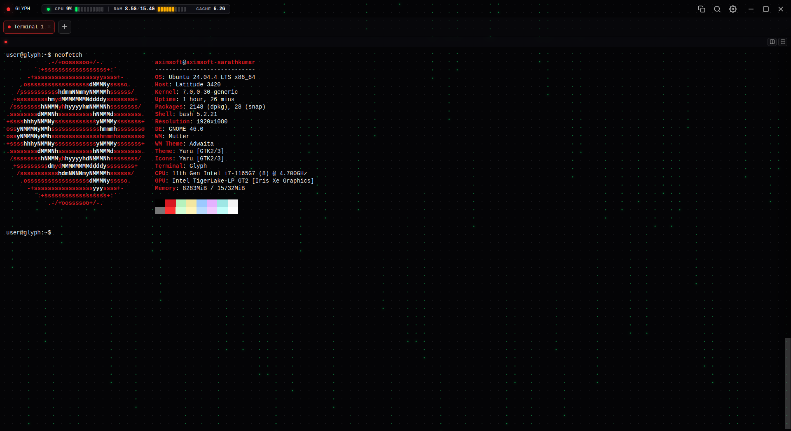
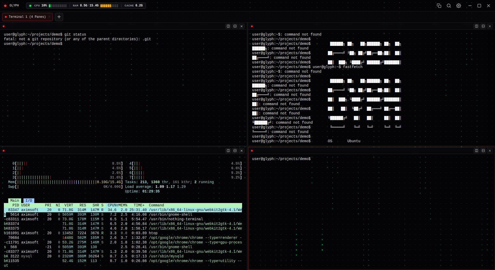
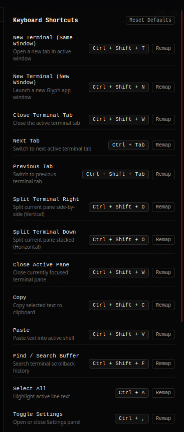
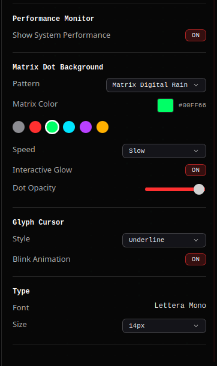

# Glyph

### A modern, customizable terminal for Linux.

> **Your terminal. Your workflow.**

[](https://github.com/SARATHKUMAR-T/glyph/actions/workflows/ci.yml)

Glyph is a modern terminal emulator built for developers who want more
control over their terminal experience --- from customizable UI and
cursors to remappable shortcuts and split panes.



[Download Glyph](../../releases/latest) · [Report a Bug](../../issues) ·
[Request a Feature](../../issues)

------------------------------------------------------------------------

## ✨ Features

### 🎨 Three UI Styles

Choose from three visual styles designed around a clean, monochromatic
terminal experience.

### 🖱️ Custom Cursor

Make the cursor yours. Choose the cursor style and control its blink
behavior.

### ⌨️ Remappable Shortcuts

Glyph comes with useful keyboard shortcuts for common terminal actions,
and you can remap them to match your workflow.

### 🔲 Panes

Split your terminal into multiple independent sessions and work
side-by-side without constantly switching windows.



### 🗂️ Workspaces

Save and reopen your entire development environment with one click. Workspaces persist pane split layouts, working directories (CWD), custom pane titles, and automatic startup commands (e.g. `npm run dev`, `cargo run`).

### 📑 Multiple Tabs

Keep independent terminal sessions organized inside a single Glyph
window.

### 🔎 Terminal Search

Search through your terminal scrollback without leaving your workflow.

### 📋 Clipboard Support

Native copy and paste support for a smoother terminal experience.

### ⚡ Native Terminal

Glyph uses a real PTY and your system shell, providing compatibility
with normal terminal applications rather than simulating a shell.

### 🧱 Shell Integration

OSC 133 shell integration allows Glyph to understand command boundaries
and terminal state.

------------------------------------------------------------------------

## 🎛️ Make Glyph Yours

Glyph gives you control over the visual experience as well as the
terminal itself.

Customize things such as:

-   UI style
-   Matrix background pattern
-   Matrix color
-   Background animation speed
-   Interactive glow
-   Dot opacity
-   Cursor style
-   Cursor blink animation
-   Terminal font
-   Font size
-   Performance monitor



------------------------------------------------------------------------

## ⌨️ Keyboard Shortcuts That Work Your Way

Glyph provides shortcuts for common terminal actions, with support for
remapping them to your preferred key combinations.

Examples include:

-   New terminal
-   Close terminal
-   Next / previous tab
-   Split terminal horizontally
-   Split terminal vertically
-   Close active pane
-   Copy
-   Paste
-   Search terminal buffer
-   Select all
-   Toggle settings



------------------------------------------------------------------------

## 📦 Installation

Download the latest release:

**[Download Glyph](../../releases/latest)**

### Ubuntu / Debian

Download the `.deb` package from the release assets and install it with:

``` bash
sudo apt install ./Glyph_0.2.0_amd64.deb
```

Then launch **Glyph** from your applications menu.

### AppImage

Download the AppImage and make it executable:

``` bash
chmod +x Glyph_0.2.0_amd64.AppImage
```

Run it:

``` bash
./Glyph_0.2.0_amd64.AppImage
```

### RPM

For RPM-based distributions, download the `.rpm` package from the
release assets.

``` bash
sudo rpm -i Glyph-0.2.0-1.x86_64.rpm
```

Or, on distributions using `dnf`:

``` bash
sudo dnf install ./Glyph-0.2.0-1.x86_64.rpm
```

### Current Platform

-   Linux
-   Ubuntu tested
-   x86_64

Windows and macOS support are planned for future releases.

------------------------------------------------------------------------

## 🛠️ Built With

  -----------------------------------------------------------------------
  Technology                          Purpose
  ----------------------------------- -----------------------------------
  **Rust**                            Native backend, PTY management and
                                      terminal lifecycle

  **Tauri 2**                         Lightweight cross-platform desktop
                                      application framework

  **React**                           Application UI

  **TypeScript**                      Frontend type safety

  **Vite**                            Frontend development and bundling

  **xterm.js**                        Terminal rendering and terminal
                                      interaction

  **portable-pty**                    Native PTY and shell management
  -----------------------------------------------------------------------

------------------------------------------------------------------------

## 🏗️ Architecture

Glyph separates the native terminal layer from the UI layer.

``` text
React / TypeScript
  ├─ Tabs
  ├─ Panes
  ├─ Settings
  ├─ Shortcuts
  └─ xterm.js
        │
        │ Tauri IPC
        ▼
Rust / Tauri
  └─ TerminalManager
      ├─ portable-pty
      ├─ Reader thread
      ├─ Shell lifecycle
      └─ OSC 133 parser
        │
        ▼
Linux PTY / System Shell
  └─ /bin/bash · /bin/zsh · $SHELL
```

### Terminal flow

1.  React requests a new terminal session through Tauri IPC.
2.  Rust creates a native PTY using `portable-pty`.
3.  The user's system shell is launched inside the PTY.
4.  A background Rust reader receives terminal output.
5.  Rust emits terminal output and semantic events to the frontend.
6.  xterm.js renders the terminal.
7.  Keyboard input is sent from the frontend through Tauri back to the
    PTY.
8.  PTY resizing is propagated whenever the terminal viewport changes.

The PTY remains the source of truth. React does not emulate the shell or
terminal process.

------------------------------------------------------------------------

## 🔐 Shell Integration

Glyph supports OSC 133 semantic shell integration for detecting command
and prompt boundaries.

Shell integration is opt-in and currently supports Bash and Zsh
integration snippets.

The integration can be installed locally without overwriting existing
shell configuration.

See the project documentation for setup details.

------------------------------------------------------------------------

## 🧪 Development

### Requirements

-   Ubuntu 24.04 or newer
-   Node.js 22.12 or newer
-   Rust stable
-   Cargo
-   Tauri Linux dependencies

Install the common Ubuntu dependencies:

``` bash
sudo apt update
sudo apt install -y build-essential curl wget file libwebkit2gtk-4.1-dev libayatana-appindicator3-dev librsvg2-dev patchelf
```

Install dependencies:

``` bash
npm install
```

Start the development application:

``` bash
npm run tauri:dev
```

Frontend-only development:

``` bash
npm run dev
```

> The browser-only Vite preview cannot attach to a real PTY because
> Tauri IPC is unavailable in a normal browser tab.

------------------------------------------------------------------------

## ✅ Checks

Run the frontend type check:

``` bash
npm run typecheck
```

Run Rust tests:

``` bash
cargo test --manifest-path src-tauri/Cargo.toml
```

Run Rust checks:

``` bash
cargo check --manifest-path src-tauri/Cargo.toml
```

Build production packages:

``` bash
npm run tauri build
```

------------------------------------------------------------------------

## 🗺️ Roadmap

### Current

-   [x] Linux terminal support
-   [x] Native PTY
-   [x] Multiple tabs
-   [x] Terminal panes
-   [x] Three UI styles
-   [x] Cursor customization
-   [x] Remappable keyboard shortcuts
-   [x] Terminal search
-   [x] Native clipboard support
-   [x] OSC 133 shell integration
-   [x] Production Linux packages

### Planned

-   [ ] Windows support
-   [ ] macOS support
-   [ ] Persistent settings
-   [ ] Persistent command history
-   [ ] Improved shell integration
-   [ ] More customization options
-   [ ] Additional workflow-focused features

------------------------------------------------------------------------

## 🤝 Contributing

Glyph is an open-source project and contributions are welcome.

If you find a bug or have an idea:

1.  Check the existing issues.
2.  Open a new issue if it has not already been reported.
3.  For code changes, create a focused pull request.
4.  Explain what changed and why.

Before contributing, please read the project's contribution guidelines
when available.

------------------------------------------------------------------------

## 🐛 Feedback

Found a bug?

**[Open an issue](../../issues/new)**

Have an idea?

**[Request a feature](../../issues/new)**

Feedback is especially valuable while Glyph is still evolving.

------------------------------------------------------------------------

## 📄 License

Glyph is released under the **MIT License**.

See [LICENSE](LICENSE) for the complete license text.

------------------------------------------------------------------------

## ☕ Support Glyph

Glyph is free and open source.

If you find it useful and want to support development, you can support the project on Buy Me a Coffee.

<a href="https://buymeacoffee.com/sarathkumar">
  
</a>


**Happy Glyping. 🖤**

