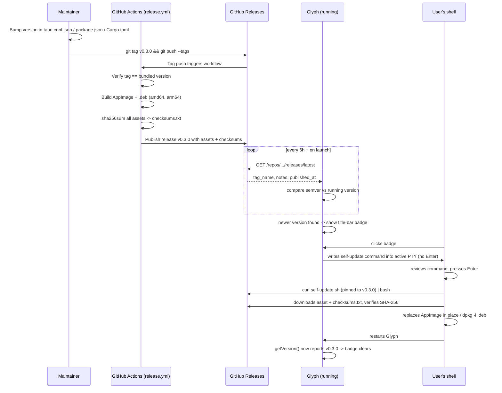

# Glyph OTA Update Lifecycle

Glyph ships from GitHub Releases, not an app store, so there's no platform-level
auto-update mechanism for it to plug into. This document defines the update
lifecycle built instead: how a release is cut, how a running app discovers
it, how it's surfaced in the UI, and how the user actually applies it — in a
way that fits Glyph's identity as a terminal app rather than bolting on a
generic installer dialog.

---

## 1. Design decision: terminal-native updates, not a silent installer

The obvious default — a background updater that downloads and swaps the
binary with no user involvement (what `tauri-plugin-updater` gives you out
of the box) — was deliberately not used here. Instead:

1. Glyph detects a newer release and shows a small badge in the title bar.
2. Clicking the badge **stages** an update command in the currently active
   terminal pane (via the same `write_terminal` IPC call every keystroke
   already goes through) — it does not run anything.
3. The user reviews the command like any other command in their shell, and
   runs it themselves by pressing Enter.

This has three concrete advantages over a silent updater:

- **Trust and transparency.** In a terminal emulator, "a command appeared
  and ran itself" is a red flag, not a feature. Staging-then-Enter keeps
  the user in control and makes the update fully inspectable before it
  executes — they can read it, edit it, or delete it.
- **No installer UI to build.** No progress bars, no "restart now?"
  modals, no separate permission prompts — the existing terminal *is* the
  update UI.
- **No code-signing infrastructure required yet.** `tauri-plugin-updater`
  requires a minisign keypair and signed update manifests before it will
  install anything. That's the right call once Glyph has a broader
  install base, but it's a real chunk of infra to stand up (key
  generation, secret storage in CI, signature verification wiring) for a
  single-maintainer, GitHub-Releases-only product today. This design gets
  a working OTA loop shipped now; see §7 for the upgrade path.

---

## 2. Lifecycle overview



---

## 3. Stage: release (maintainer + CI)

**Where:** `.github/workflows/release.yml`, triggered on pushing a tag
matching `v*.*.*`.

Steps, in order:

1. **`verify-version` job** — reads `src-tauri/tauri.conf.json`,
   `package.json`, and `src-tauri/Cargo.toml`, and fails the whole workflow
   if any of their `version` fields don't match the pushed tag. The
   running app's idea of "my version" (`getVersion()`) comes from
   `tauri.conf.json`'s `version` at build time, which takes precedence
   over Cargo.toml's — but Cargo.toml's `CARGO_PKG_VERSION` still leaks
   out elsewhere (e.g. `TERM_PROGRAM_VERSION`), so letting it drift
   produces a binary that reports two different versions depending on who
   asks. **Bumping the version in all three files is therefore always
   the first step of cutting a release, before tagging.**
2. **`build` job** (matrix: `amd64` on `ubuntu-24.04`, `arm64` on
   `ubuntu-24.04-arm`) — installs the same Tauri Linux deps as `ci.yml`,
   runs `npm run tauri build`, then copies the produced AppImage and
   `.deb` out of Tauri's bundle output into canonical, predictable names:
   `Glyph_<version>_<arch>.AppImage` and `glyph_<version>_<arch>.deb`.
   Renaming here (rather than trusting Tauri's default bundle naming)
   means the client-side update script's asset-name expectations don't
   silently break if the bundler's naming convention ever changes.
3. **`publish` job** — collects both architectures' artifacts,
   `sha256sum`s all of them into `checksums.txt`, and publishes everything
   as a GitHub Release via `softprops/action-gh-release`, with
   auto-generated release notes from the commits since the last tag.

**Why GitHub's Releases API and not a hand-rolled `latest.json`:** Tauri's
own updater plugin expects a static manifest file you host and sign
yourself. Since Glyph isn't using that plugin, there's no need to also
maintain a manifest — `GET /repos/OWNER/glyph/releases/latest` already
*is* that manifest, is CORS-enabled for the webview to call directly, and
has no infrastructure to keep in sync.

---

## 4. Stage: discovery (client polling)

**Where:** `src/lib/update/checkForUpdate.ts` + `src/hooks/useUpdateChecker.ts`.

- On mount, and every 6 hours after, the hook calls the GitHub Releases API
  and compares the release's tag (`vX.Y.Z`, "v" stripped) against
  `getVersion()` from `@tauri-apps/api/app` using a small hand-rolled
  semver comparator (`src/lib/update/version.ts` — no dependency needed
  since both inputs are release tags Glyph itself controls the format of).
- Draft and pre-release versions are ignored (`release.draft` /
  `release.prerelease` checked) so a release the maintainer hasn't
  finished publishing, or has explicitly marked as a pre-release channel,
  never triggers the badge.
- 6 hours keeps a normal user's traffic to a couple of requests a day,
  well under GitHub's 60-requests/hour-per-IP unauthenticated cap — no
  API token needed.
- A failed check (offline, GitHub down, rate-limited) is logged and
  swallowed rather than surfaced as an error — it's retried on the next
  interval regardless, so there's nothing actionable for the user to see.

---

## 5. Stage: notify (the badge)

**Where:** `src/components/window/UpdateBadge.tsx`, wired into
`TitleBar.tsx` and `App.tsx`.

- A newer release renders a small pill in the title bar's action row:
  `● Update to v0.3.0`, plus a dismiss (`×`) button.
- **Dismiss** stores the dismissed version in `localStorage`
  (`glyph.update.dismissedVersion`) so the badge doesn't reappear for that
  *specific* version — a genuinely newer release after that still shows
  normally. This is per-device, not synced anywhere; it's a "stop nagging
  me about this one" flag, not a setting.
- The same update state also drives a permanent, always-available
  **Settings → Updates** panel (current version, live status, a manual
  "Check Now", and — when one exists — a "Stage in Terminal" button), so
  the update isn't only reachable through a badge someone may have already
  dismissed.

---

## 6. Stage: apply (stage command → user presses Enter)

**Where:** `App.tsx`'s `handleApplyUpdate`, `src/lib/update/updateCommand.ts`,
`scripts/self-update.sh`.

Clicking the badge (or the Settings button) does two things to the
*currently active* terminal pane, via the existing `writeTerminalData`
IPC call — the same path every keystroke already takes, so this is
indistinguishable from the user typing it themselves:

1. Sends `Ctrl+U` (`\x15`) to clear whatever's currently on the input
   line, so the command lands clean rather than getting appended to
   whatever the user was mid-typing.
2. Writes the update command, **without a trailing newline** — nothing
   executes until the user presses Enter themselves.

The command is:

```
curl -fsSL https://raw.githubusercontent.com/SARATHKUMAR-T/glyph/v0.3.0/scripts/self-update.sh | bash -s -- v0.3.0
```

Two details matter here:

- **The script URL is pinned to the release tag being installed**, not
  `main`. `self-update.sh` is fetched from that tag's committed copy, so a
  later change to the script on `main` can never retroactively alter what
  an already-published version's update command runs.
- **`self-update.sh` never redirects its own stdin.** `curl | bash` feeds
  the script's *source* into bash via stdin, and bash keeps reading the
  rest of the script from there as it runs. An earlier version did
  `exec < /dev/tty` near the top so `sudo` could prompt for a password —
  but that swapped the script body for the keyboard, so bash sat waiting
  for the remaining script to be typed and the update silently did
  nothing (the shipped v0.2.3 script has this bug; v0.2.4 fixes it).
  Instead, only the `.deb` path's `sudo dpkg -i` redirects `< /dev/tty`,
  and only when a TTY is actually available.
- **`log()` writes to stderr**, because `download_and_verify` is called
  inside `$(...)` to capture the downloaded file's path — anything it
  printed to stdout would end up inside that path.

The script itself (Linux only, for now):

1. Detects arch (`amd64`/`arm64`) and how Glyph was installed —
   `$APPIMAGE` env var (set by the AppImage runtime itself to the running
   file's path) for AppImage installs, or `dpkg -s glyph` for `.deb`
   installs.
2. Downloads the matching asset **and** `checksums.txt` from that
   release, and refuses to proceed if the asset's SHA-256 doesn't match —
   this is the integrity check standing in for code-signing today (see
   §7 for why it isn't equivalent).
3. AppImage: overwrites the running file in place with `mv` (frictionless,
   no root). `.deb`: runs `sudo dpkg -i` on the downloaded package.
4. Prints a message pointing at **Settings → Updates → Restart Now**
   (`restartApp()` in `src/lib/update/restartApp.ts`, backed by
   `tauri-plugin-process`'s `relaunch()`) — the script never kills or
   relaunches the running process itself, since a terminal app
   force-closing itself mid-way through the user's session would be a
   worse experience than asking them to restart when convenient.

   This is a real button, not just advice, because closing the window is
   *not* enough here: Glyph has a tray icon (`src-tauri/src/tray.rs`), and
   closing the main window only hides it — the process, with the
   pre-update binary already loaded into memory, keeps running in the
   background. Reopening the window from the tray shows the *same* old
   process, so `getVersion()` keeps reporting the old version and the
   badge keeps nagging even though the file on disk has already been
   replaced. Only an actual process relaunch (full quit + re-exec) picks
   up the new binary — hence a dedicated Restart action instead of relying
   on window close.

---

## 7. Security model, honestly stated

- **What this protects against:** a compromised or corrupted download in
  transit (checksum mismatch), and a compromised `main` branch retroactively
  changing what a past release's update command executes (tag-pinning).
- **What this does *not* protect against:** a compromised GitHub release
  itself — i.e. if an attacker gets write access to the repo and publishes
  a malicious release (bad binary *and* a matching, self-consistent
  `checksums.txt`), the checksum check passes because it's only checking
  "did the file arrive intact," not "was this file produced by someone we
  trust." That second guarantee is what code-signing (`tauri-plugin-updater`
  + minisign) actually provides, and this design explicitly defers it.
- **Recommended upgrade path, once it's worth the infra:** adopt
  `tauri-plugin-updater` for the download+verify+install mechanics (keep
  the badge/staging UX identical — only swap what runs when the user
  presses Enter, from a curl-pipe to `glyph --apply-update` invoking the
  plugin), generate a minisign keypair, store the private key as a GitHub
  Actions secret, sign each release artifact in CI, and verify the
  signature (not just a hash) client-side before install.

---

## 8. Extending beyond Linux

The client-side polling, badge, and staging flow are all
platform-agnostic already — `checkForUpdate.ts` and `useUpdateChecker.ts`
don't know or care what OS they're running on. Only `self-update.sh` (and
the release workflow's asset naming) is Linux-specific. Adding macOS/Windows
later means:

- Extending `release.yml`'s build matrix with `macos-latest` /
  `windows-latest` runners producing `.dmg`/`.msi` bundles.
- Writing OS-appropriate install steps (a `self-update.ps1` for Windows,
  since `curl | bash` has no equivalent there) and having
  `buildUpdateCommand()` in `updateCommand.ts` branch on
  `navigator.platform` (or a Tauri `os` plugin call) to hand back the
  right one-liner for the active OS.

---

## 9. Files touched

| Concern | File |
|---|---|
| Version comparison | `src/lib/update/version.ts` |
| GitHub Releases fetch | `src/lib/update/checkForUpdate.ts` |
| Update command builder | `src/lib/update/updateCommand.ts` |
| Polling + dismissal state | `src/hooks/useUpdateChecker.ts` |
| Title-bar badge | `src/components/window/UpdateBadge.tsx`, `TitleBar.tsx` |
| Restart action | `src/lib/update/restartApp.ts` |
| Settings panel | `src/components/settings/Settings.tsx` |
| Wiring (active pane → PTY write) | `src/app/App.tsx` (`handleApplyUpdate`) |
| Install script | `scripts/self-update.sh` |
| Release pipeline | `.github/workflows/release.yml` |
| Tray / close-to-tray behavior | `src-tauri/src/tray.rs` |
